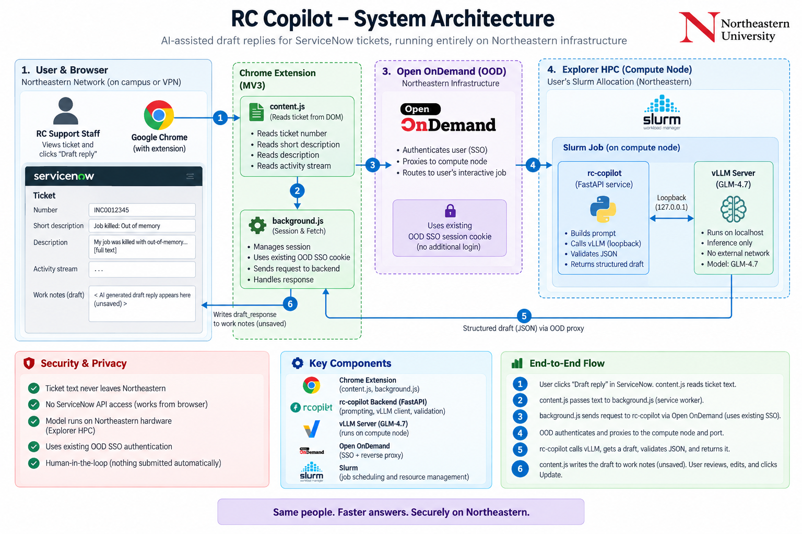

# RC Copilot — Architecture & Developer Guide

**Status:** working prototype, end to end. A real model has produced a
schema-valid draft on the cluster; draft quality is the open problem. See
[Current status](#8-current-status).

---

## 1. The problem

RC support staff answer ServiceNow tickets that are, in large part,
recognisable: out-of-memory kills, quota limits, module and environment
mistakes, access requests. Drafting each reply from scratch is repetitive work.

Two constraints shape everything that follows.

**No ServiceNow API access.** Org policy does not grant it. Anything that reads
a ticket has to work from what is already on the RC member's screen.

**Ticket text cannot leave Northeastern.** It can contain researcher names,
project details, and unpublished work. That rules out any hosted LLM API and
requires the model to run on Northeastern hardware.

Together these force an unusual shape: the *browser* is the integration point,
and the *model* runs inside the user's own Slurm allocation.

---

## 2. How it works, end to end



The same path, with the network boundary drawn explicitly:

```
   NORTHEASTERN NETWORK
   ┌──────────────────────────────────────────────────────────────────────────┐
   │                                                                          │
   │  service.northeastern.edu          Chrome                Explorer HPC    │
   │  ┌───────────────────┐      ┌──────────────────┐    ┌──────────────────┐ │
   │  │  ServiceNow       │      │  Extension       │    │ Open OnDemand    │ │
   │  │  ticket form      │      │                  │    │ ood.explorer...  │ │
   │  │                   │  (1) │  content.js      │    │                  │ │
   │  │  short_desc  ─────┼─────►│   reads DOM      │    │  SSO + node      │ │
   │  │  description      │      │        │         │    │  proxy           │ │
   │  │  work_notes ◄─────┼──────┤        ▼     (2) │    │  /rnode/<n>/<p>  │ │
   │  │      ▲            │  (6) │  background.js ──┼───►│        │         │ │
   │  └──────┼────────────┘      │   session + fetch│(3) │        │ (4)     │ │
   │         │                   └──────────────────┘    └────────┼─────────┘ │
   │         │                            ▲                       ▼           │
   │         │                            │              ┌──────────────────┐ │
   │         └────────────────────────────┘              │  Slurm job       │ │
   │                       (5) draft JSON                │  ┌────────────┐  │ │
   │                                                     │  │ rc-copilot │  │ │
   │                                                     │  │  :PORT     │  │ │
   │                                                     │  └─────┬──────┘  │ │
   │                                                     │        │ loopback│ │
   │                                                     │  ┌─────▼──────┐  │ │
   │                                                     │  │ vLLM :8000 │  │ │
   │                                                     │  │ GLM-4.7    │  │ │
   │                                                     │  └────────────┘  │ │
   │                                                     └──────────────────┘ │
   └──────────────────────────────────────────────────────────────────────────┘
```

1. RC member opens a ticket and clicks **Draft reply**. `content.js` reads the
   number, short description, description and activity stream out of the DOM.
2. It passes the text to the service worker. The content script never makes the
   network call itself — see [§6.1](#61-why-the-service-worker-makes-every-request).
3. `background.js` signs in if needed, then POSTs to the backend through OOD,
   carrying the user's existing OOD SSO cookie.
4. OOD authenticates the user and proxies to the compute node and port the job
   is listening on.
5. `rc-copilot` builds a prompt, calls vLLM over loopback, validates the JSON it
   gets back, and returns a structured draft.
6. `content.js` writes `draft_response` into **work notes** — unsaved. A human
   reviews, edits, and clicks Update.

**Nothing is ever submitted automatically.** The draft lands in a form field and
stops there.

---

## 3. Components

| Directory | Lines | What it is |
| --- | --- | --- |
| `backend/app/` | ~990 py | FastAPI service: prompt, vLLM client, auth |
| `backend/web/` | ~900 | Standalone web UI (paste-a-ticket), no build step |
| `extension/` | ~870 js | Chrome MV3 extension |
| `ood-apps/` | ~500 | Two OOD interactive apps |
| `cluster/` | ~900 | Slurm launchers, install/diagnostic scripts, capture server |

### 3.1 Backend (`rc-copilot`)

Deliberately knows nothing about ServiceNow. It takes text, returns a draft.

| File | Responsibility |
| --- | --- |
| `main.py` | Routes, error shaping, static file serving |
| `llm_client.py` | vLLM calls, structured-output fallback, JSON extraction |
| `prompts.py` | **The file to iterate on.** System prompt, confidence rubric |
| `models.py` | Pydantic models + the JSON schema sent to the model |
| `auth.py` | Access token, HMAC-signed sessions |
| `config.py` | Settings from environment / `.env` |

API surface — four endpoints:

| Endpoint | Auth | Purpose |
| --- | --- | --- |
| `GET /api/health` | none | Liveness + whether vLLM is reachable |
| `POST /api/login` | access token | Exchange token for a session |
| `POST /api/draft` | session | `{ticket_text, ticket_number?, extra_instructions?}` → draft |
| `GET /api/captures` | session | *(capture-test build only)* what's stored |

`/api/health` is deliberately unauthenticated so the extension can distinguish
"backend down" from "token wrong" — two failures with very different fixes.

### 3.2 Extension

| File | Responsibility |
| --- | --- |
| `content.js` | ServiceNow DOM: read the ticket, write the draft |
| `background.js` | **All** network I/O, session lifecycle, error wording |
| `ood-connect.js` | Runs on OOD; auto-configures from the session card |
| `popup.*` | Status display, target-field choice, manual fallback |

### 3.3 Cluster

Two OOD interactive apps, plus sbatch equivalents:

- **`ood-app/`** — the real thing: vLLM + rc-copilot in one GPU allocation.
- **`ood-app-capture/`** — no model. Stores whatever the extension sends and
  echoes it back. Used to validate the data path independently of the LLM.

---

## 4. Structured output

The model is asked for JSON, not prose:

```json
{
  "problem_summary": "…",
  "suggested_steps": ["…"],
  "confidence": 0.86,
  "caveats": ["…"],
  "draft_response": "…"
}
```

`confidence_label` (high ≥ 0.8, medium ≥ 0.6, low below) is computed
**server-side** from `confidence`. The model supplies a number; the thresholds
are ours.

Three strategies are tried in order, and the first that works is remembered:

1. `response_format: json_schema` — constrained decoding against a strict schema
2. `response_format: json_object` — for older vLLM builds
3. Prompt-only, with an explicit "raw JSON, no fences" reminder

Whatever comes back is parsed tolerantly (fenced blocks and preamble prose are
stripped) and validated against a Pydantic model. Unparseable output produces a
clear UI error, never a stack trace.

`caveats` is the "check before sending" list. It is shown in the panel and
deliberately **not** written into the ticket.

---

## 5. Security model

This is the part worth scrutinising, because the deployment forces some
uncomfortable choices.

### 5.1 The core problem

`rc-copilot` must bind `0.0.0.0`, because the OOD web node has to reach it
across the network. **That also means every other user on the cluster can reach
that port.** Everything below follows from that.

### 5.2 Controls

| Control | Detail |
| --- | --- |
| **Access token required** | `/api/draft` returns 401 without one |
| **Signed sessions** | Token exchanged for an HMAC-signed session carrying an expiry the server verifies. A forged expiry fails the signature |
| **Expiry enforced server-side** | Default 3 h, matched to the job length in the OOD app |
| **Token never on `/projects`** | That path is group-readable. The token lives in `~/.rc_copilot/token` (0600), or in OOD's `connection.yml` |
| **Never logged** | The startup banner prints the token only when self-generated for local use; under Slurm it prints a notice instead, because job logs land on shared storage |
| **vLLM on loopback** | Only `rc-copilot` can reach the model |
| **Signing key in memory** | Restarting the backend invalidates every session |
| **Extension scoped** | Host permissions cover only `northeastern.edu` / `neu.edu`; `ood-connect.js` refuses to save any other endpoint |
| **Session storage** | `chrome.storage.session` — memory only, cleared on browser close |

### 5.3 Ticket data at rest

Only the capture-test build persists ticket text. It writes to
`/scratch/$USER/rc_copilot_captures/<TICKET>/`. Because `/scratch` is mode
**770** (group-accessible, unlike `$HOME`), the subtree is forced to `0700` and
files to `0600`. The ticket-derived folder name is sanitised — it originates
from a web page, so `../../../etc/passwd` becomes `ETCPASSWD`.

The production backend stores nothing. It logs metadata only — request id,
input length, confidence, latency — never ticket text, unless `DEBUG=true`,
which prints a warning at startup.

### 5.4 Trust boundary for auto-configuration

The extension configures itself by reading the OOD session card, which contains
the endpoint and token in `data-` attributes. **Only the job's owner can see
that card** — the same trust boundary OOD already uses for Jupyter and RStudio
passwords.

---

## 6. Design decisions worth explaining

### 6.1 Why the service worker makes every request

An MV3 **content script runs in the page's origin and is subject to CORS**. A
fetch from `service.northeastern.edu` to `ood.explorer.northeastern.edu` would
be blocked regardless of what headers the backend sends. **Service worker
fetches are covered by `host_permissions` and bypass CORS entirely.**

This is why CORS headers on the backend are not the answer, and why all network
I/O funnels through `background.js`.

### 6.2 The failure mode that matters most

OOD is behind SSO. When that session expires, OOD answers **HTTP 200 with an
HTML login page** — not a 401. Code that assumes JSON reports a parse error and
sends you looking in the wrong place entirely.

`background.js` checks the content type and says exactly what happened.

### 6.3 Three ServiceNow UIs, one content script

| UI | Structure | Consequence |
| --- | --- | --- |
| Classic | Form inside `#gsft_main` iframe | Needs `all_frames: true` |
| Next Experience | Web components, shadow DOM | `querySelector` can't reach fields |
| Service Portal | AngularJS, `sp_formfield_*` ids | Different id convention again |

Rather than three sets of selectors, fields are found by a **shadow-piercing DOM
walk** and matched on id, name, `aria-label`, placeholder and label text. One
mechanism covers all three.

Two specifics that are easy to get wrong:

- **Assigning `.value` is not enough.** ServiceNow's client scripts and its
  unsaved-changes tracker only react to events. Every write goes through the
  native value setter, then dispatches `input` and `change`.
- **`description` must not match `short description`.** The matcher excludes it
  explicitly; there is a regression test for exactly this case.

### 6.4 Why the extension needs no configuration

The node and port change with every allocation, so nothing static can point at
them. OOD already solves this: it writes `connection.yml` with host, port and a
generated password per session.

We checked whether OOD exposes a sessions API to query — it does not.
`batch_connect/sessions#index` renders HTML only, and `/activejobs/json` returns
one job by id. Scraping that HTML would break on every OOD upgrade.

So instead, RC Copilot is an **OOD interactive app**, and its own session card
carries the details in markup we control. Because OOD renders each app's view
inline on "My Interactive Sessions", **visiting that page configures the
extension.** Nothing to copy.

### 6.5 Why work notes, not additional comments

Work notes are internal. Additional comments are visible to the person who filed
the ticket. Defaulting to work notes means a mis-click on Update cannot reach a
researcher with unreviewed model output. The other option exists, behind a
warning.

---

## 7. Deployment

### 7.1 Environment

Explorer's A100 nodes run driver **570.86.15**. vLLM 0.29.0's default PyPI wheel
is built against **CUDA 13**, which needs a 580-series driver. The failure is a
two-stage trap:

1. `ImportError: libcudart.so.13`
2. after putting that library on the path, vLLM's kernels fail at runtime with
   `cudaErrorInsufficientDriver` — while torch keeps working, because CUDA 12.x
   has minor-version compatibility. The model loads, then dies on first kernel
   call.

The fix is the explicitly tagged `+cu129` wheel. Note `--torch-backend=cu129` is
**not** sufficient: it selects the torch wheel, not vLLM's own extension.
`install_vllm.sh` encodes this and verifies by checking the extension links
`libcudart.so.12`.

### 7.2 Sizing

Measured on Explorer at TP=2: weights **28.08 GiB/GPU**, KV cache **41.21
GiB/GPU** → 817,248 tokens at 6.24× concurrency for 131K context.

At TP=1 the weights are ~56 GiB on one card, leaving ~12.5 GiB on an 80 GB
A100 — roughly **124,000 KV tokens**, about 3.8× concurrency at 32K context. A
ticket plus prompt is a few thousand tokens, so **one GPU is sufficient**.

This also matters because every general-access GPU partition caps GRES at
**one GPU per job**; 2+ requires `multigpu`, which needs approval.

| Partition | Max time | GPUs/job |
| --- | --- | --- |
| `gpu-interactive` | 2 h | 1 |
| `gpu-short` | 2 h | 1 |
| `gpu` | 8 h | 1 |
| `multigpu` | 24 h | 8 (approval) |

Both limits are enforced twice: in the browser via OOD's
`data-max-bc-num-hours`, and clamped server-side in `submit.yml.erb`.

### 7.3 Hardware notes

Explorer has T4 (sm75) and V100 (sm70) alongside A100 (sm80) and H200 (sm90).
**bfloat16 requires sm80+**, and most model configs request it, so on the older
cards vLLM aborts at startup. `serve_glm.sh` reads the compute capability and
falls back to `--dtype float16`. This matters because the older cards are
usually the idle ones.

A 3B test model (`Qwen2.5-3B-Instruct`, ~6 GB) is the default for exactly this
reason: it takes any free GPU, starts in about a minute, and is enough to
exercise the pipeline and iterate on the prompt.

---

## 8. Current status

### Proven

- **The full data path with real ticket data.** A live ticket produced 3,535
  characters across all three sections, travelled ServiceNow → extension → OOD →
  Slurm job on a GPU node → disk, and the ticket number was recovered.
- **Auth under adversarial input.** Tampered signatures and forged far-future
  expiries are both rejected; expiry is signed, not trusted. Verified with a
  sub-second session.
- **The OOD proxy path**, including against a simulated prefix-stripping proxy
  reproducing `/rnode/<node>/<port>`.
- **Field matching** against 15 realistic ServiceNow signatures across all three
  UIs.
- **Partition/GPU combinations** — every form combination checked against the
  documented limits, zero violations.
- **vLLM installs and imports** with the correct CUDA linkage.

### Not yet proven

- **The model has never produced a draft.** Every backend test used a stub
  returning canned JSON. Prompt quality — the actual point of the project — is
  entirely unvalidated.
- The GLM stack has not completed a run on a GPU node.
- Draft write-back into a live ticket has not been confirmed end to end.

### Open questions

1. **Policy.** v0 deliberately excluded reading and writing ticket pages; the
   extension now does both. This has not been reviewed against whatever blocked
   ServiceNow API access, and it should be before wider use.
2. **Distribution.** `Load unpacked` requires Developer mode, which managed
   Chrome profiles often restrict. Reaching the wider team means the Web Store
   or an enterprise policy push.
3. **H200 nodes** (141 GB) would hold GLM comfortably on one card with far more
   KV headroom than an A100. Worth checking which partition they sit in.
4. **Reasoning models.** GLM-4.7-Flash runs with `--reasoning-parser glm45`. If
   reasoning content leaks into the answer field, JSON parsing may need to
   separate them.

---

## 9. Running it

```bash
# 1. Capture test — no model, proves the data path
#    OOD → My Sandbox Apps → "RC Copilot - Capture Test" → Launch
#    Then open My Interactive Sessions; the extension self-configures.
ls /scratch/$USER/rc_copilot_captures/

# 2. The real thing
#    OOD → My Sandbox Apps → "RC Copilot" → Launch
#    Defaults: Qwen2.5-3B on any free GPU. Switch to GLM-4.7-Flash once
#    the pipeline is confirmed.

# 3. Prompt iteration — fastest loop, no extension, no OOD
cd backend && uvicorn app.main:app --port 8080
#    then paste tickets at http://127.0.0.1:8080
```

Helper scripts: `install_vllm.sh --check`, `check_gpus.sh`, `vllm_status.sh`,
`ood-apps/rc-copilot/check_modes.sh`, `extension/check.py`.

---

## 10. Suggested next step

Run one real inference and push 20–30 real tickets through the local web UI at
`127.0.0.1:8080`, tuning `prompts.py`. That loop needs no extension and no OOD,
and it answers the only question that decides whether any of this is worth
deploying: **are the drafts actually useful?**

Everything built so far is plumbing around that untested core.
